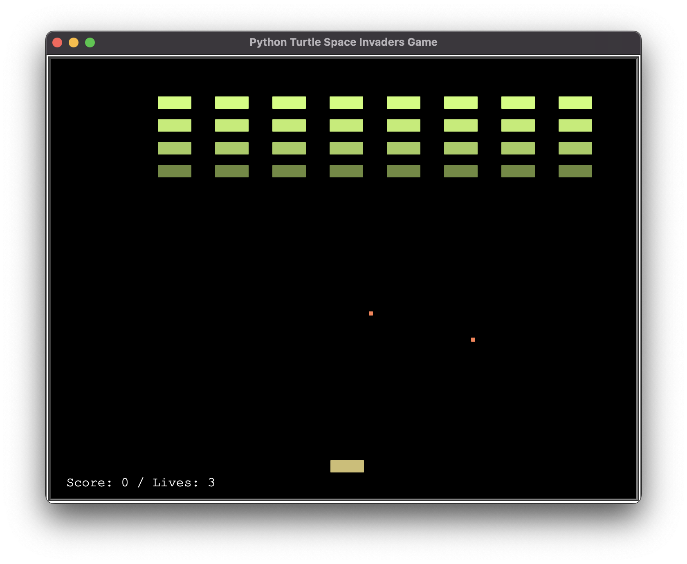
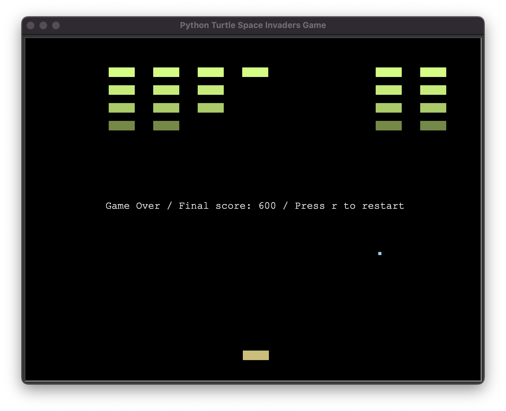

# py05_Breakout

Homework for *100 Days of Code: The Complete Python Pro Bootcamp for 2022*

Space Invaders

* Use Turtle library to write a space invaders game.

### Reference
* Code samples from the course *100 Days of Code: The Complete Python Pro Bootcamp for 2022*
* [turtle — Turtle graphics — Python 3.10.5 documentation](https://docs.python.org/3/library/turtle.html)